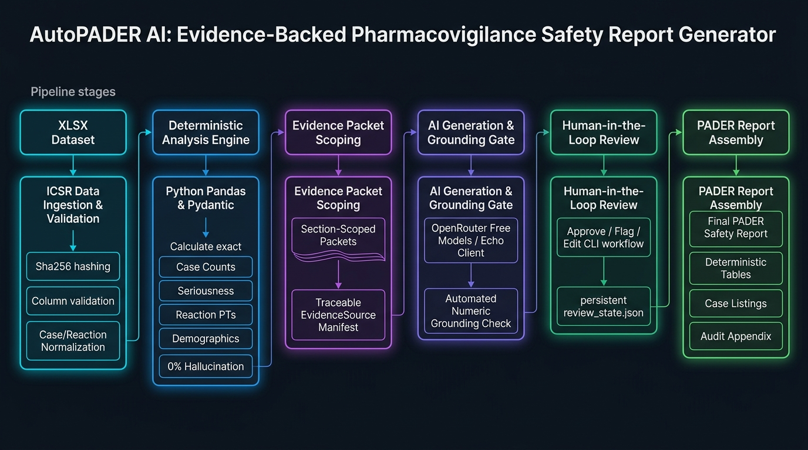

# GenAR Version 0 — Architecture



GenAR auto-generates evidence-grounded PADER-style safety reports from the
supplied Bisoprolol ICSR dataset. The core rule (AGENTS.md): the LLM must
never compute authoritative numbers; every statistic is computed
deterministically in Python, scoped into per-section "evidence packets", and
the LLM only turns them into regulatory-neutral narrative — gated by a
deterministic grounding check and human review.

## Pipeline

```
XLSX dataset
   │  load_dataset()            (loader.py, sha256 recorded)
   ▼
validate()                      (validator.py — errors block, warnings surface)
   ▼
build_case_table()              (normalizer.py — 1 row / unique safetyreportid)
build_reaction_table()          (normalizer.py — exploded PT tokens, outcome padding)
   ▼
compute_all()                   (analysis/ — every statistic + EvidenceSource)
   ▼
packet_for(section, results)    (evidence/packet.py — ONLY the section's evidence)
   ▼
generate_section()              (llm/ — prompt template → DeepSeek → narrative)
   ▼
grounding_check()               (llm/grounding.py — numbers ⊆ packet)
   ▼
review (approve / flag / edit)  (review/review.py — review_state.json)
   ▼
assemble_report()               (report/assembler.py — narrative + deterministic tables)
   ▼
write_report()                  (writer.py — report_output.md)
```

## Module map

```text
autopader/
├── config/
│   ├── settings.py          # env settings (DEEPSEEK_*, prompts dir)
│   └── report_config.py     # what a PADER report is (sections, evidence, rules)
├── data/
│   ├── columns.py           # canonical column-name constants
│   ├── loader.py            # xlsx/csv -> DataFrame + sha256
│   ├── validator.py         # required columns, domain values, alignment warnings
│   └── normalizer.py        # case table, reaction table, age buckets, countries
├── analysis/
│   ├── results.py           # EvidenceSource / AnalysisResult (pydantic)
│   ├── case_metrics.py      # totals, seriousness, expedited, sex, country, age
│   ├── reaction_metrics.py  # reaction PT counts, serious reactions, outcomes
│   └── time_trends.py       # monthly case volume + deltas
├── evidence/
│   ├── packet.py            # EvidencePacket + packet_for (scoping mechanism)
│   └── manifest.py          # ReportManifest (dataset hash, versions, evidence ids)
├── llm/
│   ├── client.py            # DeepSeekClient (httpx), EchoClient, build_client
│   ├── prompts.py           # template loading + rendering + prompt version
│   ├── grounding.py         # numbers-in-narrative ⊆ packet check
│   └── generator.py         # per-section generation + grounding gate
├── review/
│   └── review.py            # SectionReview, persistent review_state.json
├── report/
│   ├── assembler.py         # full markdown assembly (8 sections + appendix)
│   ├── case_listing.py      # case index markdown table
│   └── writer.py            # UTF-8 file output
├── pipeline.py              # run_pipeline: end-to-end orchestration
└── cli.py / __main__.py     # CLI: generate, review, analyze
prompts/*.md.tpl             # checked-in system + per-section templates
```

## Traceability

Every figure in the narrative descends from an `EvidenceSource`:

```
evidence_id   e.g. "case.total_cases"
value         the exact display string, e.g. "1,024"
provenance    "case_metrics.case.total_cases() v1.0.0 dataset:<sha256 short>"
```

`packet_for` hands a section **only** the evidence keys declared in
`report_config.REPORT_SECTIONS`, so the LLM can never see the full analysis or
the raw dataset. The report appendix lists, per section, every evidence id +
value + provenance, then the manifest (dataset sha256, analysis version, model,
prompt version, generated_at, evidence ids used).

## Deterministic guarantees

- Case counts de-duplicate by `safetyreportid` (1,068 rows → 1,024 cases).
- Seriousness/expedited are normalized from raw `serious` / `fulfillexpeditecriteria`.
- Ages are bucketed from the numeric onset-age column only
  (`patient_patientagegroup` is unreliable); garbage units (e.g. `800`) → unknown.
- Reaction analysis uses exploded PT tokens (3,642 retained; 6 rows with
  compound comma-containing PTs are padded for outcomes, never silently).
- Country falls back from `occurcountry` to `primarysource_reportercountry`.
- Trends are factual month counts/deltas only — never "signal".

## Deliberate V0 scope (honest unknowns)

- No System Organ Class (not in the dataset).
- No expectedness (no product label/CCDS supplied).
- No history-of-actions (not supplied) — stated plainly in the report.
- Grounding is a deterministic number-subset check; it does not judge semantics.